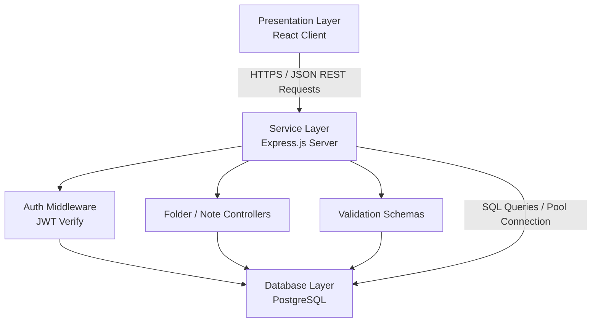
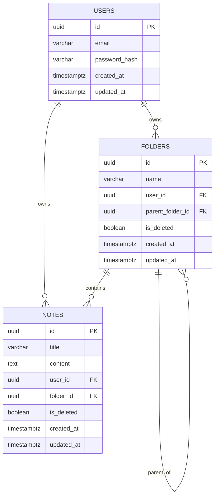

# **System Architecture & Design Document (SADD): SnapPad**

## **1. System Overview & Context**

This application uses a classic decoupled Client-Server architecture.

- **Client (Frontend):** A Single Page Application (SPA) built with React. It handles the presentation layer, local state management, markdown parsing, and optimistic UI updates.
- **Server (Backend REST API):** A stateless Express.js API. It handles routing, authentication, business logic, authorization checks, and database interactions.
- **Database:** A relational PostgreSQL database for storing persistent structured data.

## **2. High-Level System Architecture Diagram**

## **3. Key Design & Architectural Decisions**

- **A. Authentication & Session Management (JWT vs Session Cookies)**
  - **Decision:** Stateless JSON Web Tokens (JWT) transmitted via HttpOnly, Secure, SameSite=Strict cookies.
  - **Rationale:** Storing the JWT in an HttpOnly cookie mitigates Cross-Site Scripting (XSS) risks. Making the API stateless simplifies deployment, and using a token-based system keeps backend verification fast.
- **B. Directory Storage Model (Hierarchical Folders)**
  - **Decision:** Adjacency List Model (each folder points to its parent folder via parent_folder_id).
  - **Rationale:** The alternate approach (Materialized Paths) is fast for reading but complex to write, as moving a parent folder requires updating all child paths. For a note-taking app, where folders are easily moved, the Adjacency List is far more write-friendly. We will mitigate read performance issues using a Recursive CTE and proper database indexing.
- **C. Offline-First & Optimistic UI Strategy**
  - **Decision:** State-first client architecture with automatic rollback.
  - **Rationale:** When a user triggers an action (e.g., Create Note), the client generates a temporary client-side UUID, appends the note to the local React state instantly, and dispatches the API request in the background. If the API fails, the frontend catches the error, rolls back the local state, and alerts the user.

## **4. Database Schema Design (Data Model)**

### **Entity-Relationship Diagram (Conceptual)**

### **Table: users**

Represents the registered application users.

<table>
  <tr>
   <td><strong>Column Name</strong>
   </td>
   <td><strong>Data Type</strong>
   </td>
   <td><strong>Constraints</strong>
   </td>
   <td><strong>Description</strong>
   </td>
  </tr>
  <tr>
   <td>id
   </td>
   <td>UUID
   </td>
   <td>Primary Key, Default: uuid_generate_v4()
   </td>
   <td>Unique identifier for the user.
   </td>
  </tr>
  <tr>
   <td>email
   </td>
   <td>VARCHAR(255)
   </td>
   <td>Unique, Not Null
   </td>
   <td>User's login email.
   </td>
  </tr>
  <tr>
   <td>password_hash
   </td>
   <td>VARCHAR(255)
   </td>
   <td>Not Null
   </td>
   <td>Bcrypt hashed password.
   </td>
  </tr>
  <tr>
   <td>created_at
   </td>
   <td>TIMESTAMPTZ
   </td>
   <td>Default: NOW()
   </td>
   <td>Timestamp of account creation.
   </td>
  </tr>
  <tr>
   <td>updated_at
   </td>
   <td>TIMESTAMPTZ
   </td>
   <td>Default: NOW()
   </td>
   <td>Timestamp of last profile update.
   </td>
  </tr>
</table>

### **Table: folders**

Represents the hierarchical organizational units.

<table>
  <tr>
   <td><strong>Column Name</strong>
   </td>
   <td><strong>Data Type</strong>
   </td>
   <td><strong>Constraints</strong>
   </td>
   <td><strong>Description</strong>
   </td>
  </tr>
  <tr>
   <td>id
   </td>
   <td>UUID
   </td>
   <td>Primary Key, Default: uuid_generate_v4()
   </td>
   <td>Unique identifier for the folder.
   </td>
  </tr>
  <tr>
   <td>name
   </td>
   <td>VARCHAR(100)
   </td>
   <td>Not Null
   </td>
   <td>Name of the folder.
   </td>
  </tr>
  <tr>
   <td>user_id
   </td>
   <td>UUID
   </td>
   <td>FK ➔ users(id), ON DELETE CASCADE, Not Null
   </td>
   <td>Owner of the folder.
   </td>
  </tr>
  <tr>
   <td>parent_folder_id
   </td>
   <td>UUID
   </td>
   <td>FK ➔ folders(id), ON DELETE CASCADE, Nullable
   </td>
   <td>Parent folder ID. NULL means root level.
   </td>
  </tr>
  <tr>
   <td>is_deleted
   </td>
   <td>BOOLEAN
   </td>
   <td>Default: FALSE
   </td>
   <td>Soft-delete flag for the folder.
   </td>
  </tr>
  <tr>
   <td>created_at
   </td>
   <td>TIMESTAMPTZ
   </td>
   <td>Default: NOW()
   </td>
   <td>Timestamp of creation.
   </td>
  </tr>
  <tr>
   <td>updated_at
   </td>
   <td>TIMESTAMPTZ
   </td>
   <td>Default: NOW()
   </td>
   <td>Timestamp of last modification.
   </td>
  </tr>
</table>

- \
  **Unique Constraint:** UNIQUE (user_id, parent_folder_id, name) (Ensures folder name uniqueness at any given parent directory level).

### **Table: notes**

Represents the actual markdown-supported notes.

<table>
  <tr>
   <td><strong>Column Name</strong>
   </td>
   <td><strong>Data Type</strong>
   </td>
   <td><strong>Constraints</strong>
   </td>
   <td><strong>Description</strong>
   </td>
  </tr>
  <tr>
   <td>id
   </td>
   <td>UUID
   </td>
   <td>Primary Key, Default: uuid_generate_v4()
   </td>
   <td>Unique identifier for the note.
   </td>
  </tr>
  <tr>
   <td>title
   </td>
   <td>VARCHAR(255)
   </td>
   <td>Default: 'Untitled'
   </td>
   <td>Optional note title.
   </td>
  </tr>
  <tr>
   <td>content
   </td>
   <td>TEXT
   </td>
   <td>Default: ''
   </td>
   <td>Markdown formatted text content.
   </td>
  </tr>
  <tr>
   <td>user_id
   </td>
   <td>UUID
   </td>
   <td>FK ➔ users(id), ON DELETE CASCADE, Not Null
   </td>
   <td>Owner of the note.
   </td>
  </tr>
  <tr>
   <td>folder_id
   </td>
   <td>UUID
   </td>
   <td>FK ➔ folders(id), ON DELETE CASCADE, Nullable
   </td>
   <td>Associated folder. NULL means root level.
   </td>
  </tr>
  <tr>
   <td>is_deleted
   </td>
   <td>BOOLEAN
   </td>
   <td>Default: FALSE
   </td>
   <td>Soft-delete flag for the note.
   </td>
  </tr>
  <tr>
   <td>created_at
   </td>
   <td>TIMESTAMPTZ
   </td>
   <td>Default: NOW()
   </td>
   <td>Timestamp of creation.
   </td>
  </tr>
  <tr>
   <td>updated_at
   </td>
   <td>TIMESTAMPTZ
   </td>
   <td>Default: NOW()
   </td>
   <td>Timestamp of last save.
   </td>
  </tr>
</table>

## **5. Data Flow Patterns**

### **Example: Creating a Note Inside a Nested Folder**

1. **User Action:** User clicks "New Note" inside "Folder B".
2. **Client (React):**
   - Generates a new local UUID: c18f...
   - Adds { id: 'c18f...', title: 'Untitled', folder_id: 'folder-b-uuid', content: '' } to local state.
   - Renders new note instantly (UI latency &lt; 10ms).
   - Dispatches an asynchronous HTTP POST /api/notes with body: { id: 'c18f...', title: 'Untitled', folder_id: 'folder-b-uuid' }.
3. **Server (Express):**
   - Verifies user session from the JWT cookie.
   - Validates that the user actually owns folder_id (Crucial for security!).
   - Executes database query: INSERT INTO notes (id, title, folder_id, user_id) VALUES (...).
4. **Database (PostgreSQL):** Persists the note and returns a 201 Created confirmation.
5. **Client (React):** Receives 201 Created. Marks the local note state as "saved" (removes loading/sync indicator).

## **6. Security & Isolation Architecture**

- **Row-Level Validation:** Every single controller query (GET, PUT, DELETE) on notes or folders must explicitly include the user_id extracted from the JWT token in its WHERE clause.
  - _Example:_ UPDATE notes SET title = $1 WHERE id = $2 AND user_id = $3
- **Input Sanitization:** All incoming rich-text content is treated as untrusted markdown and will be sanitized on the frontend prior to rendering to prevent HTML injection/XSS.
